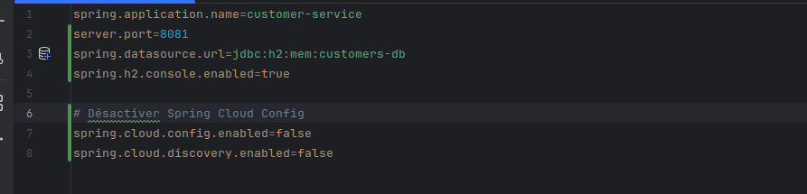
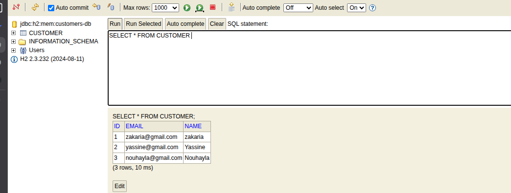
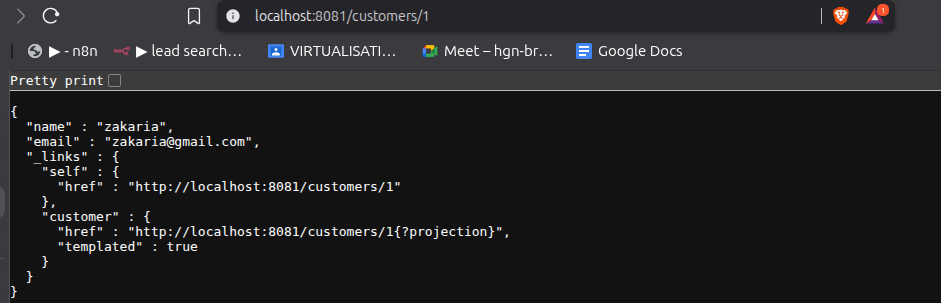
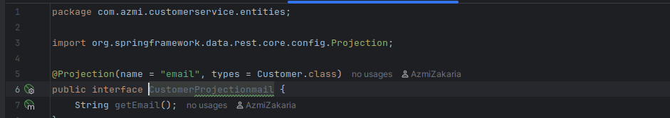
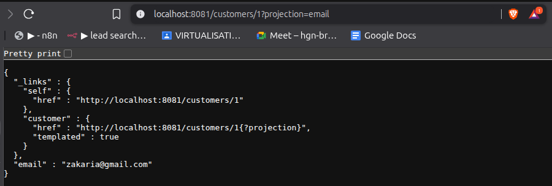

## Ecommerce application - microsercies
Nom Complet: Zakaria Azmi 
Filière: II-BDCC
Cour: Systèmes Parallèles et Distribués

## Service Customer:

### Creation de service

### Custumer entitie

### Customer repository

### Configure application.properties

### Test ajout des client dans DB

### Test Repository restresource

### Customer email projection

#### Test route

