## Ecommerce application - microsercies
Nom Complet: Zakaria Azmi 
Filière: II-BDCC
Cour: Systèmes Parallèles et Distribués

## Service Customer:

### Creation de service

### Custumer entitiy

### Customer repository

### Configure application.properties

### Test ajout des client dans DB

### Test Repository restresource

### Customer email projection

#### Test route

## Service Inventory:

### Creation de service
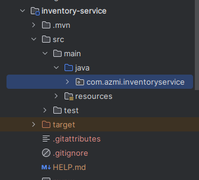

### Product entity
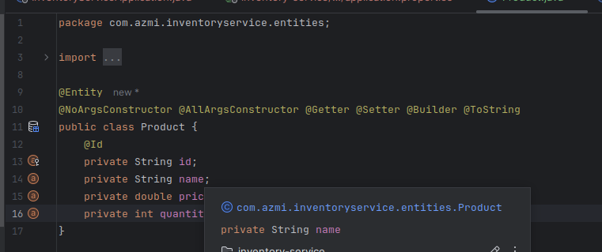
### Configure application.properties
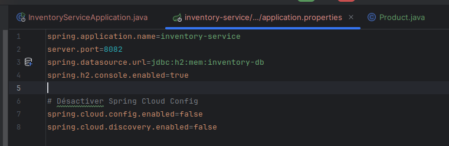
### Test Repository restresource

## Service GateWay:

### Creation de service
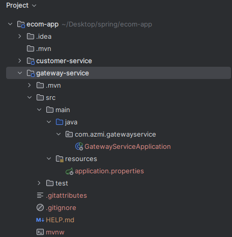

### configue gateway
#### application.properties
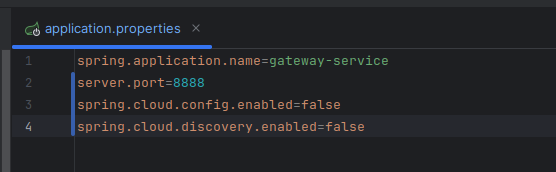
#### application.yml
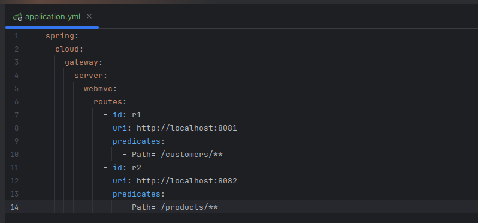

## Service Discovery:
### Creation de service
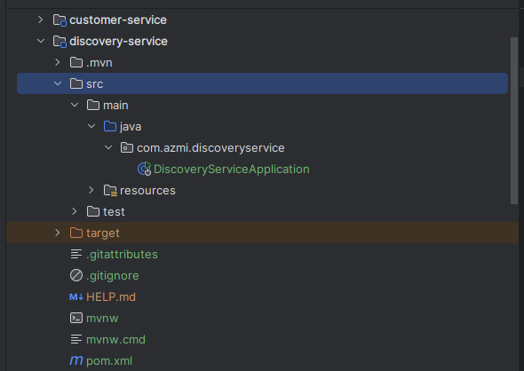
### Configuration
#### appmication.propreties

#### utilisation nom service dans gatway configue
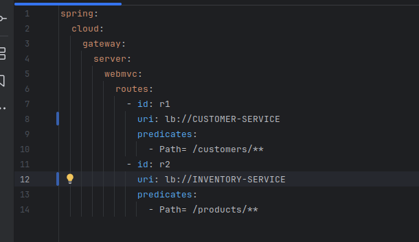
#### configuration dynamique
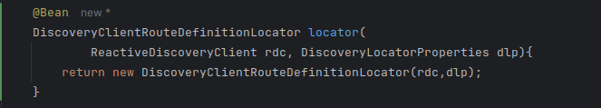
#### Tester configuration 
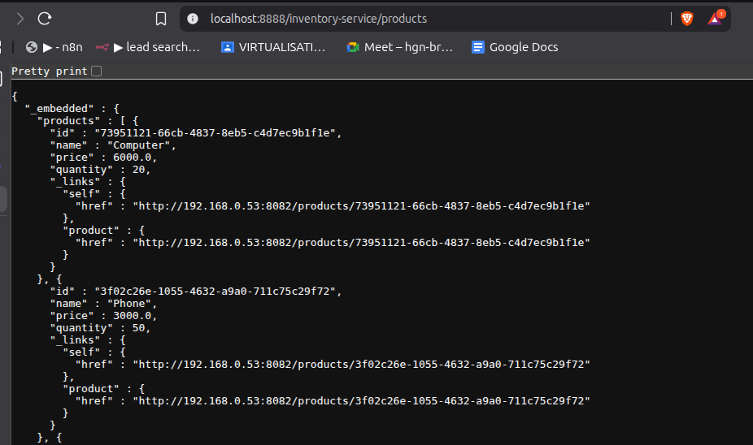

## Service billing
### Creartion des entites
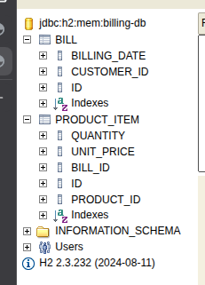
### Injection des données
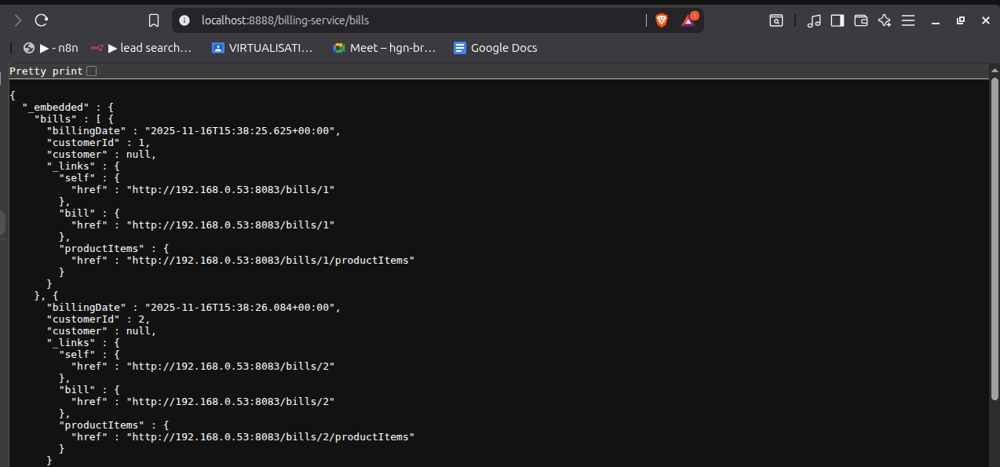